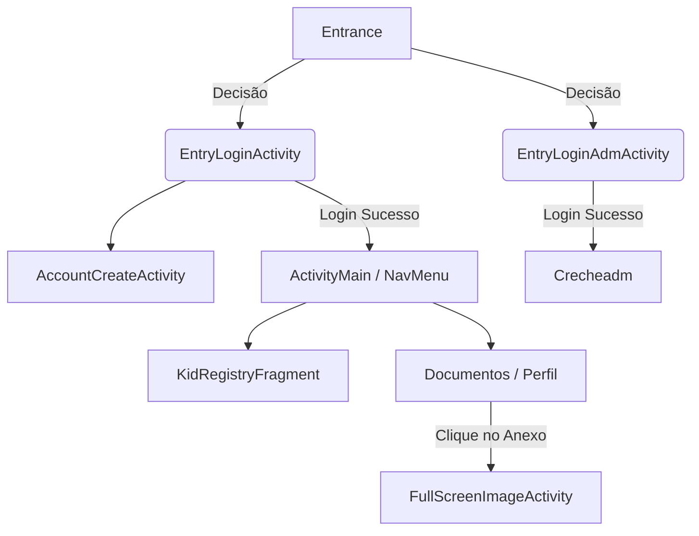

<h1 align="center">
  <br>
  
  <br>
  Sistema de Gestão de Creches (Bennu/UNEMAT)
  <br>
</h1>

<h4 align="center">Aplicativo nativo Android desenvolvido em Java para administração de matrículas, perfis de crianças e controle documental em instituições de ensino infantil.</h4>

<p align="center">
  
  
  
</p>

<p align="center">
  <a href="#-sobre-o-projeto">Sobre</a> •
  <a href="#-arquitetura-e-estrutura-de-arquivos">Arquitetura</a> •
  <a href="#-telas-e-fluxos-de-navega%C3%A7%C3%A3o">Fluxos e Telas</a> •
  <a href="#-tecnologias-e-padr%C3%B5es">Tecnologias</a> •
  <a href="#-como-executar">Como Executar</a> •
  <a href="#-autor">Autor</a>
</p>

---

## 📌 Sobre o Projeto

Este projeto (`atv_avaliativa_disp`) é uma aplicação Android desenvolvida para digitalizar o fluxo operacional de creches e facilitar a comunicação entre responsáveis e a administração. 

A aplicação soluciona a burocracia do papel através de um sistema de cadastro de crianças (`KidRegistry`), upload e verificação de documentos (`DocumentoAdapter`), além de um módulo de painel administrativo segmentado.

## 🏛 Arquitetura e Estrutura de Arquivos

A base de código segue o padrão **Model-View-Controller (MVC)** adaptado para o ciclo de vida do Android, com forte separação entre a camada de apresentação (`XML`), a lógica de controle (`Activities` / `Fragments`) e a renderização de dados dinâmicos (`Adapters`).

### 📦 Estrutura de Pacotes (`br.com.unemat.ryan.myapplication`)

```text
app/src/main/
├── java/br/com/unemat/ryan/myapplication/
│   ├── Auth & Entry           # Fluxo de entrada e autenticação
│   │   ├── Entrance.java      # Tela inicial de decisão (Splash/Roteamento)
│   │   ├── EntryLoginActivity.java    # Login para Pais/Responsáveis
│   │   ├── EntryLoginAdmActivity.java # Login para Gestores da Creche
│   │   └── AccountCreateActivity.java # Criação de novas contas
│   │
│   ├── Core Activities        # Controladores principais
│   │   ├── ActivityMain.java  # Hub principal do usuário logado
│   │   ├── Crecheadm.java     # Painel de controle da Creche
│   │   ├── KidRegistry.java   # Activity host para cadastro de crianças
│   │   ├── FullScreenImageActivity.java # Visualizador isolado de mídias/documentos
│   │   └── NavMenu.java       # Gerenciador do Bottom Navigation
│   │
│   ├── Fragments              # Componentização de telas
│   │   └── KidRegistryFragment.java # Fragmento do formulário de matrícula
│   │
│   ├── Models (Domínio)       # Representação de Dados
│   │   ├── Documento.java
│   │   └── Convite.java
│   │
│   └── Adapters               # Bind de dados dinâmicos (RecyclerView/ListView)
│       ├── CrecheAdapter.java   # Lista o catálogo de creches
│       ├── CriancaAdpter.java   # Lista os perfis das crianças associadas
│       ├── DocumentoAdapter.java# Lista os anexos e PDFs
│       └── PerfilAdapter.java   # Renderiza configurações de conta
│
└── res/
    ├── layout/                # +20 Layouts XML (kidregistry.xml, accountcreate.xml, etc)
    ├── menu/                  # Definições do BottomNav (bottom_nav_menu.xml)
    ├── drawable/              # Ícones vetoriais, fundos com bordas arredondadas e Material Icons
    └── color/                 # Seletores de cores para navegação (selector_nav_color.xml)
```

## 🔄 Fluxos e Telas de Navegação



### 1. Módulo de Segurança e Acesso
O sistema bifurca a experiência do usuário logo na inicialização. A classe `Entrance.java` direciona o fluxo para gestores (`EntryLoginAdmActivity.java`) ou para responsáveis (`EntryLoginActivity.java`). O layout utiliza inputs customizados definidos em `accountcreate.xml`.

### 2. Gestão de Crianças e Creches
Através da `ActivityMain.java` operando em conjunto com o `NavMenu.java`, o usuário acessa seus dependentes renderizados pelo `CriancaAdpter.java`. O cadastro é modularizado através do `KidRegistryFragment.java`, permitindo uma UI limpa sem a necessidade de instanciar múltiplas Activities.

### 3. Visualização Documental
Um dos diferenciais da arquitetura é a `FullScreenImageActivity.java`, projetada para interceptar cliques vindos do `DocumentoAdapter.java` e exibir atestados, fotos ou PDFs cadastrados em um modal imersivo e seguro, facilitando a validação pela creche.

## 🚀 Tecnologias e Padrões

- **Java 8+:** Linguagem core da lógica de negócios.
- **Android SDK & Gradle:** Gerenciamento nativo de build, dependências (`build.gradle.kts`) e ofuscação de código (`proguard-rules.pro`).
- **Padrão ViewHolder (Adapters):** Reciclagem de memória otimizada utilizando custom layouts (`list_item_documento.xml`, `item_creche.xml`).
- **Material UI Components:** Botões padronizados (`button_background.xml`), inputs arredondados (`border_white.xml`), e seletor de estados do BottomNavigation (`selector_nav_color.xml`).
- **Custom Dialogs:** Implementação de caixas de diálogo flutuantes exclusivas (`dialog_imagem_com_botao.xml`, `dialog_motivo.xml`) para validação de ações rápidas.

## ⚙️ Como Executar o Projeto

1. **Pré-requisito:** Instale o [Android Studio](https://developer.android.com/studio).
2. Clone o repositório em sua máquina:
   ```bash
   git clone https://github.com/seu-usuario/atv_avaliativa_disp.git
   ```
3. Abra o Android Studio e selecione **"Open"**. Navegue até a pasta clonada (onde está o arquivo `settings.gradle.kts`).
4. Aguarde a sincronização completa do **Gradle**.
5. Configure um Emulador (AVD) ou conecte um smartphone Android físico com modo de depuração ativo.
6. Clique em **Run (Shift + F10)**.

## 📄 Licença e Créditos

Projeto desenvolvido como Atividade Avaliativa (UNEMAT). Arquitetura de código e design sob a autoria do desenvolvedor.

---
<p align="center">
  Desenvolvido com ☕ e código por <strong>Ryan Zucchi (Bennu)</strong>
</p>
